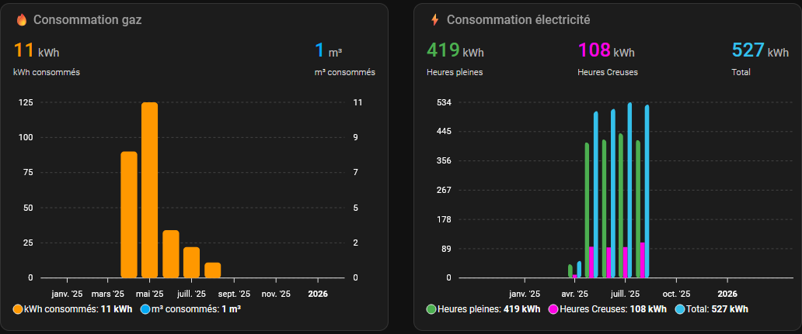
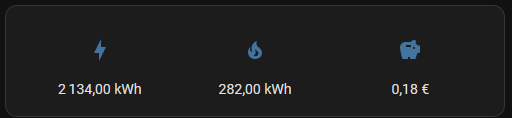

# Intégration Octopus Energy French pour Home Assistant

Cette intégration permet de récupérer les données de votre compte Octopus Energy France dans Home Assistant, incluant les soldes de vos compteurs, la consommation électrique et gaz, ainsi que le solde de votre cagnotte.

## Fonctionnalités

- **Sensors de solde** : Affiche le solde de vos compteurs électrique et gaz
- **Sensor de cagnotte** : Montre le solde de votre cagnotte Octopus
- **Détails de consommation** : Ventilation mensuelle HP/HC pour l'électricité
- **Mises à jour automatiques** : Actualisation configurable des données
- **Multi-comptes** : Support de plusieurs comptes Octopus

## Installation

### Via HACS (recommandé)

1. Ajoutez ce dépôt comme dépôt personnalisé dans HACS
2. Recherchez "Octopus Energy French" dans HACS
3. Installez l'intégration
4. Redémarrez Home Assistant


[](https://my.home-assistant.io/redirect/hacs_repository/?owner=domodom30&repository=ha-octopus-french&category=integration)

### Manuellement

1. Copiez le dossier `octopus_energy_french` dans votre dossier `custom_components`
2. Redémarrez Home Assistant
3. Ajoutez l'intégration via l'interface Configuration → Intégrations

## Configuration

1. Allez dans Configuration → Intégrations
2. Cliquez sur "+ Ajouter une intégration"
3. Recherchez "Octopus Energy French"
4. Entrez vos identifiants Octopus Energy :
   - Email
   - Mot de passe
5. Sélectionnez le numéro de compte à suivre
6. Configurez les options (intervalle de mise à jour, etc.)

## Capteurs disponibles

### Octopus Energy Cagnotte
- **Type** : Monétaire (€)
- **Attributs** : 
  - Solde brut (centimes)
  - Solde en euros
  - Numéro de compte

### Electricity Energy
- **Type** : Énergie (kWh)
- **Attributs** :
  - Consommation totale
  - Ventilation mensuelle HP/HC
  - Dernière mise à jour
  - Identifiant du point de mesure

### Gas Energy  
- **Type** : Énergie (kWh)
- **Attributs** :
  - Consommation totale mensuelle
  - Dernière mise à jour
  - Dates des premières/dernières lectures
  - Identifiant du point de mesure

## Options de configuration

- **Intervalle de mise à jour** : 1 à 24 heures (par défaut : 4h)

## Dépannage

### Problèmes d'authentification
- Vérifiez vos identifiants Octopus Energy
- Assurez-vous que votre compte est actif

### Données manquantes
- Les compteurs sans consommation peuvent ne pas apparaître

### Dashboard

 

### Ex: Consommation de gaz avec ApexChart

```yaml
type: custom:apexcharts-card
graph_span: 1y
span:
  start: year
header:
  show: true
  title: 🔥 Consommation gaz
  show_states: true
  colorize_states: true
yaxis:
  - id: kwh
    show: true
    decimals: 0
    min: 0
    opposite: false
  - id: m3
    show: true
    decimals: 0
    min: 0
    opposite: true
apex_config:
  chart:
    background: rgba(0,0,0,0)
    foreColor: "#ffffff"
    fontFamily: Roboto, sans-serif
    stacked: false
  theme:
    mode: dark
  plotOptions:
    bar:
      columnWidth: 80%
      borderRadius: 4
  dataLabels:
    enabled: false
  grid:
    show: true
    borderColor: "#444444"
    strokeDashArray: 3
  xaxis:
    labels:
      style:
        colors: "#ffffff"
        fontSize: 11px
  yaxis:
    - title:
        text: kWh
        style:
          color: "#ff9800"
    - opposite: true
      title:
        text: m³
        style:
          color: "#03a9f4"
  legend:
    show: true
    position: bottom
    horizontalAlign: left
    fontSize: 12px
    fontWeight: 400
    labels:
      colors: "#ffffff"
    markers:
      width: 20
      height: 20
      radius: 4
  tooltip:
    theme: dark
    style:
      fontSize: 12px
    x:
      formatter: |
        EVAL:(timestamp) => {
          const date = new Date(timestamp);
          return date.toLocaleDateString('fr-FR', { month: 'long', year: 'numeric' });
        }    
series:
  - entity: sensor.gas_energy_account_number
    name: kWh consommés
    type: column
    yaxis_id: kwh
    color: "#ff9800"
    data_generator: |
      const data = [];
      const attributes = entity.attributes;

      Object.keys(attributes).forEach(key => {

        if (key.match(/^\d{4}-\d{2}$/) || key.startsWith('Month ')) {
          let monthKey, value;
          
          if (key.match(/^\d{4}-\d{2}$/)) {
            monthKey = key;
            value = parseFloat(attributes[key]);
          } else if (key.startsWith('Month ')) {
            monthKey = key.replace('Month ', '');
            value = parseFloat(attributes[key]);
          }
          
          if (!isNaN(value) && monthKey) {
            const [year, month] = monthKey.split('-');
            const monthIdx = parseInt(month, 10) - 1;
            data.push([new Date(year, monthIdx, 1).getTime(), value]);
          }
        }
      });

      // Trier par date
      data.sort((a, b) => a[0] - b[0]);
      return data;
  - entity: sensor.gas_energy_account_number
    name: m³ consommés
    type: line
    yaxis_id: m3
    stroke_width: 0
    color: "#03a9f4"
    unit: m³
    data_generator: |
      const data = [];
      const attributes = entity.attributes;
      const conversionFactor = 10.7;

      Object.keys(attributes).forEach(key => {
        if (key.match(/^\d{4}-\d{2}$/) || key.startsWith('Month ')) {
          let monthKey, value;
          
          if (key.match(/^\d{4}-\d{2}$/)) {
            monthKey = key;
            value = parseFloat(attributes[key]);
          } else if (key.startsWith('Month ')) {
            monthKey = key.replace('Month ', '');
            value = parseFloat(attributes[key]);
          }
          
          if (!isNaN(value) && monthKey) {
            const [year, month] = monthKey.split('-');
            const monthIdx = parseInt(month, 10) - 1;

            const value_m3 = value / conversionFactor;
            data.push([new Date(year, monthIdx, 1).getTime(), Math.round(value_m3)]);
          }
        }
      });

      // Trier par date
      data.sort((a, b) => a[0] - b[0]);
      return data;


```

### Logs
Les logs détaillés sont disponibles dans les logs Home Assistant avec le filtre :
```yaml
logger:
  logs:
    custom_components.octopus_energy_french: debug